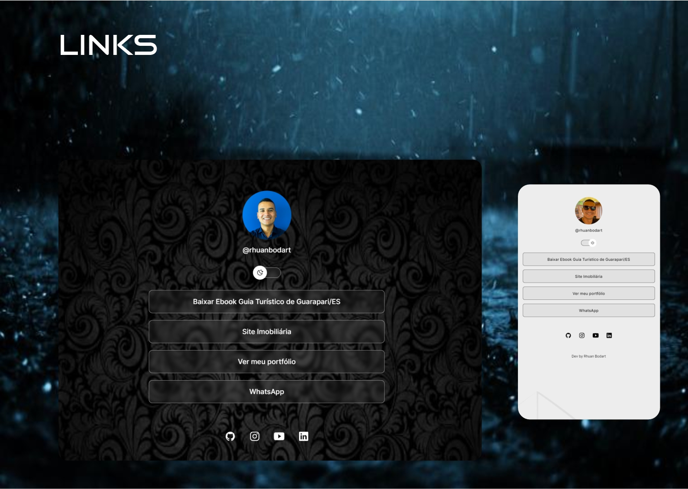

<h1 align="center"> Personal Links </h1>

Programa gratuito, ensinado pela Rocketseat ensino e demonstração de tecnologias WEB.  
<a href="https://lp.rocketseat.com.br/devlinks/inscricao?utm_source=github&utm_medium=descricao&utm_campaign=capture-devlinks&utm_term=organic&utm_content=descricao-github-mayk-brito">Estude esse projeto em formato de vídeo clicando aqui.</a>

 

  

## 🚀 Tecnologias

Esse projeto foi desenvolvido com as seguintes tecnologias:

- HTML e CSS
- JavaScript
- Git e Github
- Figma

## 💻 Projeto

Agregador de links para usar como cartão de visitas online.

# teste
